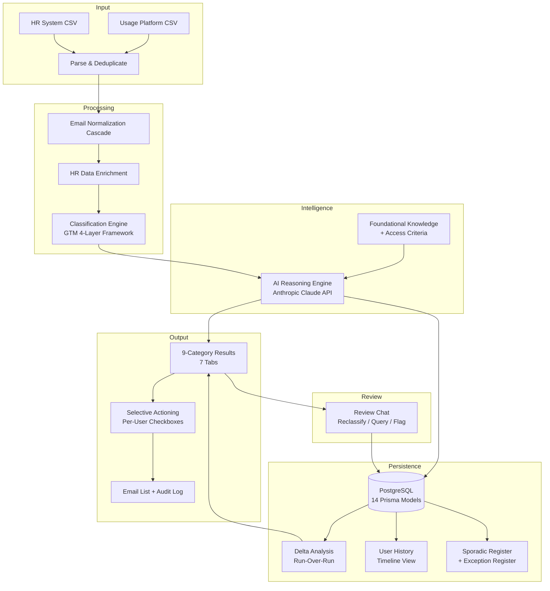

# Design: License Clean-Up Agent — Build Sync & Case Study Update

**Date:** 2026-04-29
**Scope:** Documentation-only sync from company repo → personal repo, case study content update, architecture diagram addition

---

## Context

The company repo (`LightspeedHQ/license-cleanup-agent`) has 7 recent commits that changed the application's architecture. The personal sanitized repo (`mahdeen-reza/license-cleanup-agent`) and the portfolio case study page don't reflect these changes. This creates a mismatch between the live app and its public documentation.

### What Changed in the Company Repo

| Commit | Change | Sanitized Equivalent |
|---|---|---|
| `c43fb1b` | Replace AWS Bedrock with Anthropic API + prompt caching | Already uses Anthropic SDK — update docs for prompt caching, batch size, concurrency |
| `26c48fc` | Security hardening (helmet, error handler, non-root Docker) | Already has helmet — update docs for error handler, Docker changes |
| `18e67eb` | Async pipeline (202 pattern, background processing, status polling) | Mirror as-is |
| `e9f23c0` | In-progress runs + ISSUP ticket submission workflow | Generalize: "ISSUP" → "ticket", "JSM" → "ticketing portal" |
| `de98a6b` | Parallel AI reasoning batches (8-worker pool, batch size 50) | Mirror as-is |
| `e281c1a` | Auto-expire stale processing runs (20min timeout) | Mirror as-is |
| `6d3669a` | Doc updates for parallel batch processing | Basis for doc changes |

---

## Part 1: Personal Repo Documentation Updates

**Working directory:** `/Users/mahdeen-reza.amin/projects/license-cleanup-agent-public`
**Remote:** `https://github.com/mahdeen-reza/license-cleanup-agent.git`

### Sanitization Rules

| Company Term | Personal Repo Term |
|---|---|
| ISSUP | support ticket |
| ISSUP-1234 | TICKET-1234 |
| Jira portal / JSM | ticketing portal |
| Zylo | usage platform (already sanitized) |
| Workday | HR system (already sanitized) |
| Lightspeed / Coolify / Vibe Platform | (omitted — already sanitized) |

### README.md Changes

The README's Mermaid diagram already uses generic labels ("AI Reasoning Engine") — no diagram changes needed.

**Additions to Key Features section:**
- Async analysis pipeline — background processing with real-time status polling
- In-progress runs — resume incomplete reviews across sessions
- Ticket submission workflow — pre-filled modal, opens ticketing portal, records ticket number for audit trail
- Parallel AI batching — 8 concurrent API calls reducing AI step to ~1 minute for large datasets

**Tech stack table update:**
- No change needed — already says "Anthropic Claude API"

### ARCHITECTURE.md Changes

**Section 6 — Database Schema:**
- Add to AnalysisRun model: `status` (processing/completed/failed), `statusDetail`, `errorMessage`, `reviewStatus` (in_progress/submitted), `ticketNumber`, `submittedAt`
- Add `@@unique([systemId, userEmail])` on PriorException
- Add `chatOverrides ChatOverride[]` relation on AnalysisRun
- Add `@default(0)` on count fields

**Section 7 — API Routes:**
- `POST /api/analysis/run` → returns 202, runs async
- Add `GET /api/analysis/:runId/status` — lightweight polling for pipeline progress
- Add `GET /api/analysis/in-progress` — in-progress runs for current user
- Add `PUT /api/analysis/:runId/check` — toggle single result checkbox (real-time persistence)
- Add `POST /api/analysis/:runId/submit` — record ticket number and finalize run
- Add response schemas for 202 and status polling

**Section 8 — Intelligence Layer:**
- Replace Bedrock code sample with Anthropic `client.messages.create()` + `cache_control: { type: 'ephemeral' }` on system context
- Update batch size to 50, concurrency to 8
- Add explanation of prompt caching economics (first batch pays full + cache write, subsequent batches ~10% for cached system context)
- Update per-user data format note (pipe-delimited tabular)

**Pipeline Steps (Section 9):**
- Step 0: Create run record with status="processing", return 202
- Step 12: Batches of 50 users, 8 in parallel, statusDetail updated as batches complete
- Step 17: Mark run status="completed"
- Add PUT /check and POST /submit endpoint documentation

### PRD.md Changes

- User flows: async pipeline start, real-time checkbox persistence, generalized ticket submission
- Non-goals: update to reflect ticket content is generated but submitted manually
- Tech references: Anthropic API replaces Bedrock
- Pipeline flow diagram: async pattern (create record → return 202 → background processing)
- Phase 1 scope: add async pipeline, in-progress runs, ticket submission workflow

---

## Part 2: Portfolio Case Study Content Updates

**Working directory:** `/Users/mahdeen-reza.amin/projects/portfolio-website`
**File:** `src/lib/projects.ts` — license-cleanup-agent project

All changes are strictly additive — existing content stays untouched.

### Architecture Section — New Subsection

Add a new subsection "### Production Hardening" at the end of the existing Architecture body:

Content covers:
- **Async pipeline**: 202 pattern, background processing, status polling with real-time progress updates ("AI reasoning: batch 5 of 34"), concurrent run guard, stale run detection (20min)
- **Parallel AI batching**: 8-worker pool processing batches of 50 users concurrently. Reduces AI step from ~8 minutes (sequential) to ~1 minute for 1700+ users
- **Prompt caching**: Static system context cached across all batches via Anthropic's prompt caching. First batch pays full input cost + cache write; subsequent batches pay ~10% for the cached portion
- **Ticket submission workflow**: Pre-filled submission modal, analyst submits via ticketing portal, ticket number recorded for audit trail. Run lifecycle: processing → review in progress → submitted.

### What's Next Section — Update

Add a note that some items previously described as "next" are now done: async pipeline eliminates the timeout bottleneck, ticket submission closes the copy-paste gap. Remaining Phase 2 items stay as-is.

### Status Field

Update from "Phase 1 complete, Phase 2 infrastructure ready" to reflect the production hardening work.

### techStack Array

No change — "Anthropic Claude API" already listed.

---

## Part 3: Architecture Diagram

### Approach

Render the Mermaid diagram from the personal repo's README to a static SVG, commit it to the personal repo under `architecture/`, and reference it in the case study via ``.

This matches the existing pattern in the SaaS License Monitor case study and works with the ImageLightbox component already in the Markdown renderer.

### Mermaid Source (from personal repo README lines 28-64)

### Rendering

Use the Mermaid CLI (`mmdc`) to render to SVG. If not installed, use an alternative approach (npx @mermaid-js/mermaid-cli or manual render).

### Placement in Case Study

Add `` at the top of the Architecture section body, before the existing prose. Same pattern as the SaaS License Monitor case study.

---

## Files Modified

### Personal Repo (`license-cleanup-agent-public`)

| File | Change |
|---|---|
| `README.md` | Add async pipeline, in-progress runs, ticket submission to features list |
| `ARCHITECTURE.md` | Schema updates, new API endpoints, async pipeline, prompt caching, parallel batching |
| `PRD.md` | User flows, tech stack, pipeline diagram, Phase 1 scope |
| `architecture/pipeline_architecture.svg` | New — rendered from existing Mermaid diagram |

### Portfolio Website (`portfolio-website`)

| File | Change |
|---|---|
| `src/lib/projects.ts` | Architecture section content, What's Next update, status field |

---

## Verification

1. Personal repo: Review all doc changes for sanitization compliance (no company names, no ISSUP/JSM references)
2. Personal repo: Confirm SVG renders correctly via raw.githubusercontent.com after push
3. Portfolio website: `npm run build` — no TypeScript errors
4. Portfolio website: Dev server — verify Architecture section shows diagram + new content, What's Next reflects updates
5. Portfolio website: Confirm other case study pages are unaffected
6. Confirm git remote is personal account after all operations
